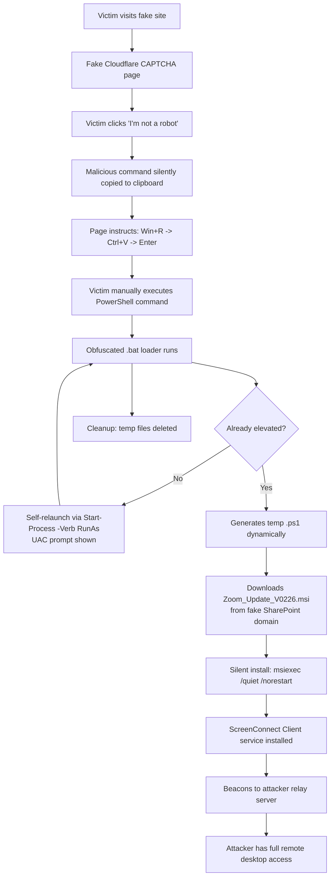
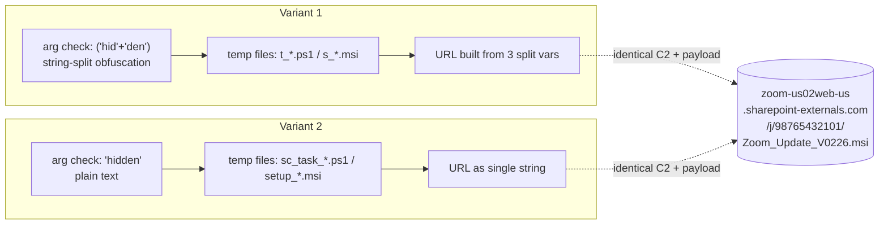

# 🎣 Fake Zoom Update → ScreenConnect RAT Deployment


> Educational, defensive-security threat intelligence writeup documenting a phishing campaign that abuses a legitimate remote-access tool (ScreenConnect) via a fake "Zoom Update" lure and an obfuscated BAT/PowerShell dropper chain.

---

## ⚠️ Disclaimer

This repository exists for **educational, malware-analysis, and defensive-security purposes only**.
No functional malicious payload, live command, or working C2 client is included or reproduced here.
All indicators are provided to support detection engineering, threat hunting, and awareness — **not** to enable reuse.
Do not execute anything from this repo. Do not visit the listed domains. All IOCs are defanged.

---

## 📌 Executive Summary

| | |
|---|---|
| **Campaign type** | Phishing → RMM tool abuse (initial access) |
| **Lure** | Fake "Zoom" software update |
| **Delivery** | Fake CAPTCHA page ("ClickFix" technique) → obfuscated `.bat` loader |
| **Final payload** | Legitimate, unmodified **ScreenConnect Client** installer, reconfigured with attacker infrastructure |
| **Attacker C2** | `relay.hochoukisenmontenmoriyamas[.]click:8041` |
| **Sophistication** | Low–Medium (2/5) — commodity dropper kit, legitimate RMM abuse |
| **Primary risk** | Full remote desktop control + persistence, not automated data theft |

The infection starts with a **ClickFix-style fake CAPTCHA** that tricks the user into pasting and running a PowerShell one-liner via `Win+R`. That command triggers a self-elevating `.bat` loader, which silently downloads and installs a legitimate **ScreenConnect (ConnectWise Control)** client — reconfigured to phone home to attacker-controlled relay infrastructure. This is a classic **"RMM-as-a-RAT"** access-broker pattern: no custom malware code, just a signed legitimate tool with malicious configuration.

---

## 🧬 Infection Chain



---

## 🎭 Stage 1 — The Fake CAPTCHA (ClickFix)

A fake Cloudflare Turnstile-style verification page. No real technical exploit — pure social engineering.

**Deceptive elements observed:**
- Dynamically fetched favicon based on a `site` URL parameter (spoofs any brand)
- Fake, randomly-generated Cloudflare "Ray ID"
- Fake, randomly-generated "reCAPTCHA Verification ID"
- Full i18n support (English/Russian detected via `navigator.languages`) → multi-region targeting
- Convincing animation sequence: preloader → checkbox → spinner → fake "success" checkmark

**The actual mechanism:**
- On checkbox click, JavaScript silently writes a malicious command to the clipboard (`document.execCommand('copy')` / Clipboard API)
- A `copy` event listener **overwrites clipboard contents** even if the user tries to copy something else in the meantime
- The page then instructs the victim: `Win+R` → `Ctrl+V` → `Enter`
- Because a human manually triggers execution, this bypasses many technical controls that only watch for script-initiated process launches

| MITRE ATT&CK | Technique |
|---|---|
| T1204.004 | User Execution: Malicious Copy and Paste |
| T1027 | Obfuscated Files or Information (page-level social engineering) |

---

## 🧱 Stage 2 — The Obfuscated BAT Loader

Two near-identical variants were recovered (same campaign, re-obfuscated loader):



**Behavior:**
1. **Self-elevation** — checks its own argument; if not `"hidden"`, relaunches itself via `Start-Process -Verb RunAs`, triggering the Windows UAC prompt
2. **Dynamic script generation** — writes a randomly-named `.ps1` to `%TEMP%` at runtime (evades static file signatures)
3. **Fake SharePoint domain** — downloads the MSI from a typosquatted domain impersonating Microsoft SharePoint
4. **Silent MSI install** — `msiexec /i ... /quiet /norestart /L*v <logfile>`
5. **Anti-forensics cleanup** — deletes the generated `.ps1` and downloaded `.msi` after execution

| MITRE ATT&CK | Technique |
|---|---|
| T1548.002 | Abuse Elevation Control Mechanism: Bypass UAC |
| T1036.005 | Masquerading: Match Legitimate Name or Location |
| T1218.007 | System Binary Proxy Execution: Msiexec |
| T1105 | Ingress Tool Transfer |
| T1070.004 | Indicator Removal: File Deletion |

---

## 📦 Stage 3 — The Payload: Legitimate ScreenConnect, Reconfigured

Static analysis of the MSI (via `lessmsi`) confirmed this is the **genuine, unmodified ScreenConnect Client installer** — not a fork or patched binary. The abuse is entirely in the configuration.

**Key MSI properties recovered:**

| Property | Value |
|---|---|
| Manufacturer | ScreenConnect Software |
| ProductName | ScreenConnect Client (be1534bbe323c228) |
| ProductVersion | 24.3.7.9067 |
| ProductCode | `{C84F5988-7F52-A155-E292-DE9E64BA3437}` |
| UpgradeCode | `{E91251D9-DEE3-0FDB-BE15-34BBE323C228}` |

**The critical parameter — `SERVICE_CLIENT_LAUNCH_PARAMETERS`:**
```
?e=Access&y=Guest&h=relay.hochoukisenmontenmoriyamas[.]click&p=8041&k=<session key>
```
This single string configures the client to phone home to the attacker's own ScreenConnect relay/panel, using an attacker-specific instance ID (`be1534bbe323c228`).

**Why this matters:** no custom code needs to be reverse-engineered — the "malware" is a legitimately signed product, which lets it slip past many AV/EDR products that trust its publisher signature. This is the well-documented **RMM abuse / access-broker pattern** used as an initial-access vector, frequently as a precursor to ransomware or manual data theft.

| MITRE ATT&CK | Technique |
|---|---|
| T1219 | Remote Access Software |
| T1036.005 | Masquerading (legitimate signed binary, malicious config) |

---

## 🎯 Why "It Doesn't Steal Anything" Is the Wrong Takeaway

ScreenConnect has no built-in credential dumper, browser-cookie grabber, or keylogger. But it doesn't need one:

- **Full interactive desktop control** — the operator can manually browse to and exfiltrate anything: saved browser sessions, password manager vaults, documents
- **Built-in file transfer** — no automation needed, the operator just drags and drops
- **Remote shell access** — the operator can launch any secondary tool (credential dumpers, ransomware, lateral movement frameworks) manually, once inside
- **Persistent Windows service** — unlike a one-shot stealer, the access stays open until removed

This is an **access broker tool**: the real damage happens *after* install, driven by a human operator, not by the installer itself.

---

## 🚨 Indicators of Compromise (IOCs)

> All network indicators below are defanged.

| Type | Value |
|---|---|
| SHA256 (MSI) | `3A29D4F3C9A914FA31C854C32629B0B32C417AABAEDE35396FFEFBEF4F7C5809` |
| MD5 (MSI) | `4F27900F71125CD74BC3157153EB548B` |
| Payload filename | `Zoom_Update_V0226.msi` |
| Staging domain | `zoom-us02web-us[.]sharepoint-externals[.]com` |
| Staging URL | `hxxps://zoom-us02web-us[.]sharepoint-externals[.]com/j/98765432101/Zoom_Update_V0226.msi` |
| **C2 / relay server** | `relay.hochoukisenmontenmoriyamas[.]click:8041` |
| Attacker instance ID | `be1534bbe323c228` |
| ScreenConnect ProductCode | `{C84F5988-7F52-A155-E292-DE9E64BA3437}` |
| Temp file patterns | `%TEMP%\t_*.ps1`, `%TEMP%\s_*.msi`, `%TEMP%\sc_task_*.ps1`, `%TEMP%\setup_*.msi` |
| Installed service name | `ScreenConnect Client (be1534bbe323c228)` |

---

## 🛡️ Detection

### YARA — BAT loader

```yara
rule Dropper_BAT_FakeZoomUpdate_UACBypass_v2
{
    meta:
        description = "Detects BAT dropper family using UAC self-elevation and fake Zoom MSI installer - covers obfuscated and clear-text variants"
        malware_family = "FakeZoomInstaller"
        date = "2026-09-13"

    strings:
        $uac1 = "-Verb RunAs" ascii wide
        $uac2 = "RunAs" ascii wide
        $uac3 = /\(\s*'hid'\s*\+\s*'den'\s*\)/ ascii wide
        $uac4 = "\"hidden\"" ascii wide

        $c2_domain = "sharepoint-externals.com" ascii wide nocase
        $c2_full = "zoom-us02web-us" ascii wide nocase
        $payload_name = "Zoom_Update_V0226.msi" ascii wide nocase
        $payload_path = "/j/98765432101/" ascii wide

        $msi1 = "/quiet /norestart" ascii wide
        $msi2 = "msiexec" ascii wide nocase
        $msi3 = "/L*v" ascii wide

        $dl1 = "System.Net.WebClient" ascii wide
        $dl2 = "DownloadFile" ascii wide

        $struct1 = "EnableDelayedExpansion" ascii
        $struct2 = "PassThru" ascii wide
        $struct3 = /del \/f \/q .*\.ps1/ ascii wide
        $struct4 = /del \/f \/q .*\.msi/ ascii wide

    condition:
        uint16(0) != 0x5A4D and
        (
            ($c2_domain and $c2_full and $payload_name)
            or
            (1 of ($uac*) and 2 of ($msi*) and all of ($dl*) and 2 of ($struct*))
        )
}
```

### YARA — Network IOC (payload-agnostic)

```yara
rule Network_IOC_FakeZoomInstaller_C2
{
    meta:
        description = "Matches exact malicious infrastructure regardless of loader wrapper"
        type = "network_ioc"

    strings:
        $url_full = "https://zoom-us02web-us.sharepoint-externals.com/j/98765432101/Zoom_Update_V0226.msi" ascii wide

    condition:
        $url_full
}
```

### Detection ideas (SOC / EDR)

- Alert on `msiexec.exe` spawned as a child of `powershell.exe`, itself a child of `cmd.exe`, with the MSI path under `%TEMP%`
- Alert on `Start-Process ... -Verb RunAs` originating from a `.bat`/`.cmd` script re-invoking itself
- Monitor for ScreenConnect service installs where `SERVICE_CLIENT_LAUNCH_PARAMETERS` points to a relay host not on your organization's approved ScreenConnect allowlist
- Flag DNS/network requests to `*.click` TLD domains combined with ScreenConnect relay traffic on non-standard ports

---

## 📊 Sophistication Assessment

**Score: 2 / 5 (Low–Medium)**

| Factor | Assessment |
|---|---|
| Obfuscation | Trivial (string concat, or none at all in v2) |
| Payload encryption/packing | None |
| Anti-VM / anti-sandbox | None observed |
| C2 infrastructure | Static, reused across variants — no DGA/rotation |
| Domain quality | Fairly crude typosquat, human-noticeable |
| Persistence | None in the loader itself (payload provides persistence via Windows service) |
| Social engineering quality | Well executed (Zoom + SharePoint lure is coherent for corporate targets) |
| Payload choice | Smart — reuses a signed, trusted RMM tool instead of custom malware |

**Conclusion:** likely a **commodity dropper kit**, reused by a moderately-skilled operator rather than a custom build from an advanced actor. The social-engineering design is more mature than the loader's software engineering.

---

## 📁 Repository Structure

```
.
├── README.md
├── loaders/
│   ├── variant1_obfuscated.bat.txt   (defanged, non-executable)
│   └── variant2_cleartext.bat.txt    (defanged, non-executable)
├── yara/
│   ├── dropper_bat_fakezoom.yar
│   └── network_ioc_fakezoom.yar
├── iocs.md
└── screenshots/
    └── fake_captcha_page.png
```

---

## 📚 References & Further Reading

- ClickFix technique — widely documented across the security research community as a fake-CAPTCHA social engineering pattern
- ScreenConnect/RMM abuse as initial access — documented in multiple public vendor threat reports (Huntress, Sophos, and others track this pattern in ransomware precursor activity)
- MalwareBazaar submission guidelines: https://bazaar.abuse.ch/

---

## 🤝 Contributing

Found a related sample, a new variant, or additional infrastructure tied to this campaign? Open an issue or PR with the hash and any new IOCs — please keep all samples password-protected (`infected`) if attached, and defang all URLs/domains.

---

*This research is shared under TLP:CLEAR for the benefit of the defensive security community.*
